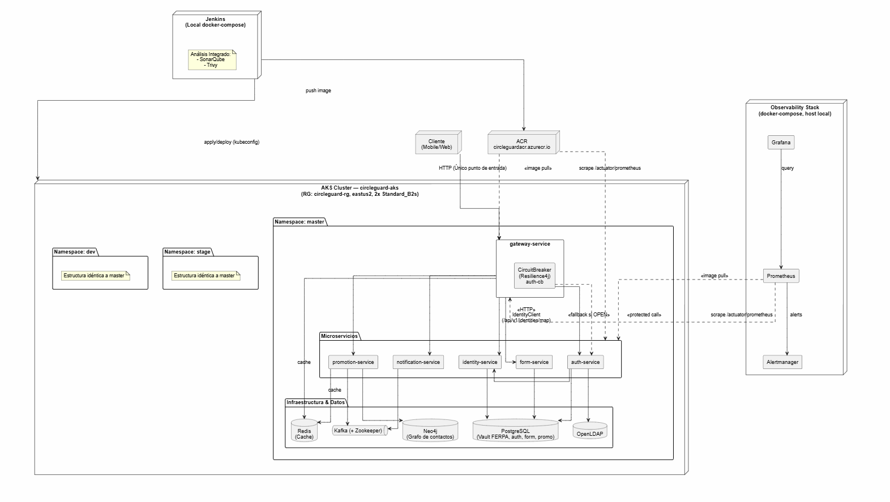

# Arquitectura — CircleGuard

## 1. Visión general

CircleGuard es un sistema de rastreo de contactos universitario basado en
una **arquitectura de microservicios**, desplegado en un clúster
**Azure Kubernetes Service (AKS)** y construido/entregado mediante pipelines
de **Jenkins** sobre 3 ambientes: `dev`, `stage` y `master` (producción).

```
                 ┌──────────────────────────────────────────┐
                 │              Cliente (Mobile/Web)         │
                 └───────────────────┬────────────────────────┘
                                      │
                              ┌───────▼────────┐
                              │  gateway-service │  (entrada única, circuit breaker)
                              └───────┬────────┘
          ┌───────────┬───────────────┼───────────────┬───────────────┐
          ▼           ▼               ▼               ▼               ▼
   auth-service  identity-service  form-service  notification-service  promotion-service
          │           │               │               │               │
          ▼           ▼               ▼               ▼               ▼
     PostgreSQL     Neo4j          PostgreSQL       Kafka          PostgreSQL
     (vault FERPA)  (grafo de      OpenLDAP                         + Kafka
                     contactos)
```

> `dashboard-service` y `file-service` existen en `services/` pero no forman
> parte del flujo desplegado por los pipelines de Jenkins (no están en
> `k8s/templates/`).

## 2. Microservicios

| Servicio | Responsabilidad | Datos |
|---|---|---|
| `gateway-service` | Punto de entrada único, ruteo, Circuit Breaker (Resilience4j) hacia `auth-service` | — |
| `auth-service` | Autenticación, autorización | PostgreSQL, OpenLDAP |
| `identity-service` | Anonimización / mapeo de identidad (vault FERPA) | PostgreSQL |
| `form-service` | Check-ins, formularios de síntomas/contacto | PostgreSQL |
| `notification-service` | Notificaciones asíncronas | Kafka |
| `promotion-service` | Máquina de promoción de estado (Suspect → Probable → Confirmed), recorridos de grafo | Neo4j, Kafka |

## 3. Infraestructura base (`k8s/infrastructure/`)

Manifiestos declarativos aplicados vía `envsubst` en cada pipeline:

- `postgres.yml` — base de datos relacional (vault de identidad, auth, forms, promotion)
- `neo4j.yml` — base de datos de grafos para el motor de promoción de contactos
- `redis.yml` — cache
- `kafka.yml` — bus de eventos asíncronos
- `openldap.yml` — directorio de autenticación
- `rbac.yml` — ServiceAccount, Role y RoleBinding (`circleguard-app`) con permisos de solo lectura sobre `configmaps`, `secrets`, `services`, `endpoints` y `pods` del namespace propio. Asociado a los 6 microservicios vía `serviceAccountName`.

## 4. Ambientes y namespaces

| Ambiente | Namespace K8s | Pipeline | Pruebas |
|---|---|---|---|
| Desarrollo | `dev` | `Jenkinsfile.dev` | Unitarias + integración |
| Staging | `stage` | `Jenkinsfile.stage` | E2E (REST Assured) + carga (Locust) |
| Producción | `master` | `Jenkinsfile.master` | — (gate de aprobación manual) |

## 5. Infraestructura como código (Terraform)

`terraform/` gestiona, por **workspace** (`dev` / `stage` / `prod`), el
recurso `kubernetes_secret.circleguard_secrets` (`terraform/modules/security`)
con las credenciales de Postgres, Neo4j y OpenLDAP por namespace. El resto de
la infraestructura (bases de datos, microservicios, RBAC) se gestiona vía
`kubectl apply` + `envsubst` desde Jenkins, para evitar conflictos de estado
entre Terraform y el pipeline.

`terraform/azure-infra/` provisiona los recursos de Azure: clúster AKS
`circleguard-aks` (2x `Standard_B2s`, `eastus2`, resource group
`circleguard-rg`) y el registro de contenedores ACR
`circleguardacr.azurecr.io`.

## 6. CI/CD (Jenkins)

Pipeline general (`Jenkinsfile.master`, los de `dev`/`stage` son variantes
reducidas):

1. **Checkout**
2. **Build & Test** (Gradle, JUnit)
3. **Static Code Analysis** (SonarQube)
4. **Docker Build & Push** (6 imágenes → ACR)
5. **Container Security Scan** (Trivy, falla con vulnerabilidades CRÍTICAS)
6. **Prepare K8s Config** (kubeconfig de AKS)
7. **Approval for Production Deploy** *(solo `master`)* — gate manual (`input`) antes de tocar producción
8. **Deploy Infra** (`k8s/infrastructure/*.yml` vía `envsubst`)
9. **Deploy Services** (`k8s/templates/*.yml` vía `envsubst`, rollout status de los 6 servicios)
10. **Generate Release Notes** *(solo `master`)* — genera y commitea `RELEASE_NOTES.md`, crea y pushea tag `vX.Y.<build>`

Evidencia de ejecución: [Entregables/Jenkins/](../Entregables/Jenkins/) (Console Output y Stage View de los 3 pipelines), [Pipeline.dev_Evidence.png](../Pipeline.dev_Evidence.png), [test_passing.png](../test_passing.png).

## 7. Calidad y seguridad

- **SonarQube**: análisis estático de los microservicios Java en cada build.
- **Trivy**: escaneo de vulnerabilidades de contenedores (HIGH/CRITICAL) sobre `gateway-service` y `auth-service`.
- **RBAC**: ver sección 3.
- **Change Management**: cada release a producción genera un tag de versión y `RELEASE_NOTES.md` commiteado (ver [Jenkinsfile.master](../Jenkinsfile.master), stage "Generate Release Notes"). Procedimiento de reversión documentado en [ROLLBACK_PLAN.md](../ROLLBACK_PLAN.md).

## 8. Resiliencia: Circuit Breaker

`gateway-service` implementa un **Circuit Breaker** (Resilience4j) en las
llamadas a `auth-service`. Cuando `auth-service` cae, el circuito se abre y
el gateway responde con fallback en lugar de propagar errores en cascada.

Evidencia:
- [Circuit_breaker.png](../Circuit_breaker.png) — configuración/estado del Circuit Breaker
- [auth_curl.png](../auth_curl.png) — pruebas de la llamada vía `curl` con `auth-service` caído
- [auth_grafana.png](../auth_grafana.png) — métricas del circuito en Grafana

## 9. Observabilidad

Stack desplegado en `observability/` (Prometheus, Grafana, Alertmanager).
Todos los microservicios expuestos en `k8s/templates/` configuran
`readinessProbe` y `livenessProbe` apuntando a `/actuator/health`.

| Componente | Evidencia |
|---|---|
| Prometheus — todos los servicios up | [prometheus_all_up.png](../prometheus_all_up.png) |
| Prometheus — servicios down (detección de fallo) | [prometheus_all_down.png](../prometheus_all_down.png) |
| Grafana — dashboard general | [grafana_dashboard.png](../grafana_dashboard.png) |
| Grafana — todos los servicios up / down | [grafana_all_up.png](../grafana_all_up.png) / [grafana_all_down.png](../grafana_all_down.png) |
| Prometheus — dashboard de métricas | [prometheus_dashboard.png](../prometheus_dashboard.png) |
| Alertmanager — alertas activas / resueltas | [alertmanager_all_up.png](../alertmanager_all_up.png) / [alertmanager_all_down.png](../alertmanager_all_down.png) |

## 10. Diagrama de despliegue (deployment)

Diagrama UML de despliegue sobre AKS: namespaces (`dev`/`stage`/`master`),
microservicios, Circuit Breaker (gateway → auth), bases de datos/colas
(PostgreSQL, Neo4j, Redis, Kafka, OpenLDAP), CI/CD (Jenkins ↔ ACR ↔ AKS) y
observabilidad (Prometheus/Grafana/Alertmanager).


