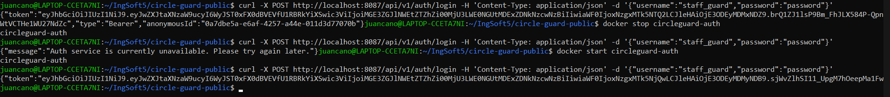
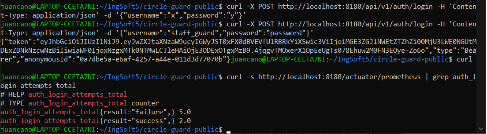
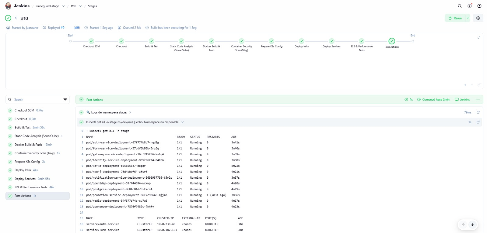
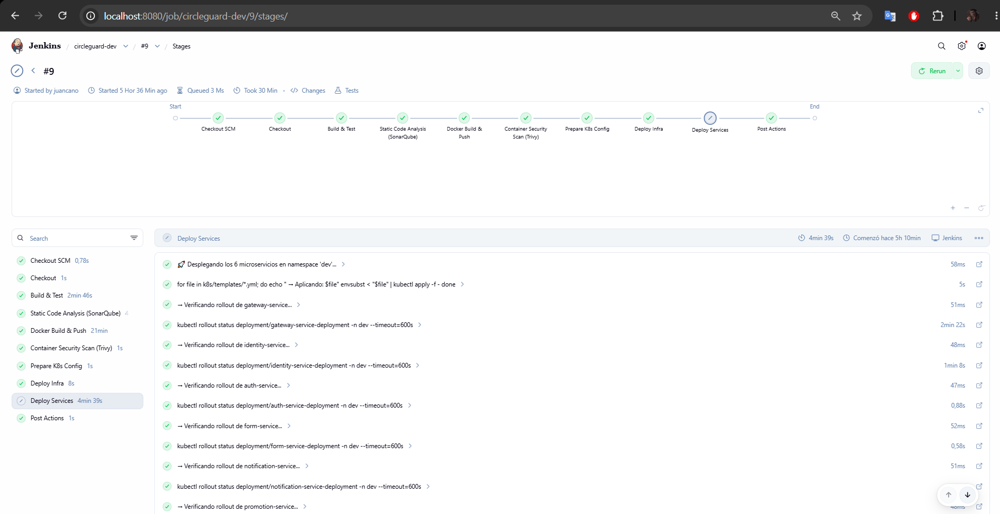
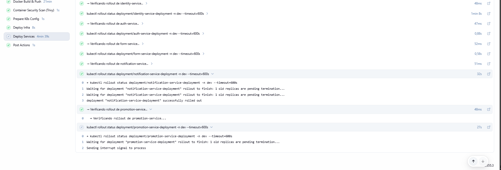

# Informe Final — Proyecto CircleGuard (IngSoft V)

> Repositorio base: https://github.com/jcmunozf/circle-guard-public
> Este informe consolida y referencia la documentación técnica detallada
> ubicada en `docs/` y en la raíz del repositorio.

## 0. Resumen ejecutivo

CircleGuard es un sistema de rastreo de contactos universitario implementado
como **arquitectura de microservicios** (6 servicios), desplegado sobre
**Azure Kubernetes Service (AKS)** mediante **Terraform** (infraestructura)
y **Jenkins** (CI/CD), con stack de **observabilidad** (Prometheus, Grafana,
Alertmanager), **RBAC**, **Circuit Breaker**, y proceso formal de **Change
Management**.

Documentación de referencia completa:
- [docs/ARCHITECTURE.md](ARCHITECTURE.md) — arquitectura, infraestructura, CI/CD, observabilidad, diagrama de despliegue
- [docs/METODOLOGIA_AGIL.md](METODOLOGIA_AGIL.md) — backlog, historias de usuario, trazabilidad
- [docs/DESIGN_PATTERNS.md](DESIGN_PATTERNS.md) — patrones de diseño implementados
- [docs/OPERATIONS_MANUAL.md](OPERATIONS_MANUAL.md) — manual de operaciones
- [HOW_TO_RUN.md](../HOW_TO_RUN.md) — guía de ejecución local
- [ROLLBACK_PLAN.md](../ROLLBACK_PLAN.md) — plan de rollback
- [terraform/README.md](../terraform/README.md) — infraestructura como código

---

## 1. Metodología Ágil y Estrategia de Branching (10%)

### Metodología
El equipo trabaja bajo **Scrum**, con backlog gestionado en **Jira**
(proyecto `IDSPF`). El detalle completo de historias de usuario, criterios
de aceptación y trazabilidad HU → entregable está en
[docs/METODOLOGIA_AGIL.md](METODOLOGIA_AGIL.md).

Backlog del Sprint 2 (6 historias de usuario):
1. Estabilización de despliegues locales y Secrets
2. Infraestructura como Código (Terraform)
3. Calidad Continua (SonarQube + Trivy)
4. Stack de Observabilidad (Prometheus, Grafana)
5. Experimentos de Caos y Resiliencia (Circuit Breaker)
6. Gobernanza y Gestión de Cambios (RBAC, aprobación a prod, release notes)

### Estrategia de branching
**GitHub Flow** simplificado con 3 ramas long-lived que mapean a los
ambientes de despliegue:

| Rama | Ambiente | Pipeline |
|---|---|---|
| `develop` | `dev` | `Jenkinsfile.dev` |
| `stage` | `stage` | `Jenkinsfile.stage` |
| `master`/`main` | `master` (producción) | `Jenkinsfile.master` |

El trabajo de feature se hace en ramas `feature/*`, `fix/*`, `docs/*`, que
se integran a `develop` vía Pull Request. La promoción entre ambientes se
hace mediante PR/merge entre `develop` → `stage` → `master`, con
aprobación manual obligatoria antes de `master` (ver sección 4 y 6).

### Iteraciones
El proyecto avanzó en al menos 2 iteraciones reflejadas en el historial de
PRs del repositorio: una primera iteración centrada en estabilización de
infraestructura/Terraform/observabilidad/resiliencia, y una segunda
iteración enfocada en gobernanza (RBAC, aprobación a producción, change
management) y documentación final.

---

## 2. Infraestructura como Código con Terraform (20%)

Detalle completo en [terraform/README.md](../terraform/README.md) y
[docs/ARCHITECTURE.md §5](ARCHITECTURE.md#5-infraestructura-como-código-terraform).

### Estructura modular
```
terraform/
├── main.tf                  # módulo raíz: Secrets de K8s por namespace
├── variables.tf
├── modules/security/        # kubernetes_secret circleguard-secrets
├── environments/            # dev.tfvars, stage.tfvars, prod.tfvars
└── azure-infra/
    ├── main.tf               # provisiona AKS + ACR
    └── modules/aks/
```

### Múltiples ambientes
Cada ambiente (`dev`, `stage`, `prod`) es un **Terraform workspace**
independiente del módulo raíz, con su propio `.tfvars`:

| Ambiente Jenkins | Namespace K8s | Workspace Terraform | tfvars |
|---|---|---|---|
| dev | `dev` | `dev` | `environments/dev.tfvars` |
| stage | `stage` | `stage` | `environments/stage.tfvars` |
| master | `master` | `prod` | `environments/prod.tfvars` |

### Backend remoto del estado
Ambos módulos usan backend remoto (sin `.tfstate` local ni en git):

| Módulo | Backend | Ubicación |
|---|---|---|
| `azure-infra/` | `azurerm` | Storage Account `circleguardtfstate`, container `tfstate` |
| Raíz (`main.tf`) | `kubernetes` | `Secret` `circleguard-state` dentro del cluster `circleguard-aks`, uno por workspace |

### Diagrama de infraestructura
Ver diagrama ASCII completo en [terraform/README.md](../terraform/README.md#diagrama-de-infraestructura)
(AKS, ACR, Resource Group, Storage Account de estado, Secrets por namespace)
y el [Diagrama de Despliegue](../Deployment_Diagram.png) en
[docs/ARCHITECTURE.md §10](ARCHITECTURE.md#10-diagrama-de-despliegue-deployment).

> **Nota:** los recursos de aplicación (bases de datos, microservicios,
> RBAC) se gestionan vía `kubectl apply` + `envsubst` desde Jenkins, no
> desde Terraform, para evitar conflictos de estado — decisión documentada
> en `terraform/main.tf` y `terraform/README.md`.

---

## 3. Patrones de Diseño (10%)

Documentación completa en [docs/DESIGN_PATTERNS.md](DESIGN_PATTERNS.md).

### Patrones existentes en la arquitectura
- **API Gateway** (`gateway-service`, Spring Cloud Gateway)
- **Repository** (`LocalUserRepository` y equivalentes)
- **Event-Driven / Observer** (`@KafkaListener` en notification/promotion-service)
- **Anonymization Vault** (segregación identidad ↔ grafo de contactos, FERPA)

### Patrones implementados/mejorados (los 3 requeridos)

| Categoría | Patrón | Dónde |
|---|---|---|
| Resiliencia | **Circuit Breaker** (Resilience4j) | `gateway-service` → `auth-service`, con `FallbackController` (`/fallback/auth`) |
| Configuración | **External Configuration** | Variables de entorno y `Secret` inyectados vía `envsubst` (Jenkins) + Terraform — misma imagen Docker promovida entre dev/stage/prod |
| Configuración | **Feature Toggle** | `FeatureFlagsProperties.visitorHandoffEnabled` en `auth-service`, controla el endpoint `/visitor/handoff` |

Cada patrón está documentado con su configuración, funcionamiento y
beneficio en `docs/DESIGN_PATTERNS.md`.

**Evidencia del Circuit Breaker** (gateway → auth):



---

## 4. CI/CD Avanzado (15%)

Pipelines completos en Jenkins: `Jenkinsfile.dev`, `Jenkinsfile.stage`,
`Jenkinsfile.master` — detalle en [docs/ARCHITECTURE.md §6](ARCHITECTURE.md#6-cicd-jenkins).

### Stages del pipeline (Jenkinsfile.master, los de dev/stage son variantes reducidas)
1. Checkout
2. Build & Test (Gradle, JUnit)
3. Static Code Analysis (**SonarQube**)
4. Docker Build & Push (6 imágenes → ACR)
5. Container Security Scan (**Trivy**, falla con vulnerabilidades CRÍTICAS)
6. Prepare K8s Config
7. **Approval for Production Deploy** *(solo master)* — gate manual `input`
8. Deploy Infra (`k8s/infrastructure/*.yml`)
9. Deploy Services (`k8s/templates/*.yml`, rollout status de 6 servicios)
10. **Generate Release Notes** *(solo master)* — commit + tag `vX.Y.<build>`

### Ambientes separados con promoción controlada
`dev` → `stage` (E2E + Locust) → `master` (aprobación manual obligatoria),
correspondientes a los namespaces de AKS `dev`/`stage`/`master`.

**El pipeline `circleguard-stage #10` ejecutó todos sus stages
exitosamente** (Checkout, Build & Test, SonarQube, Docker Build & Push,
Trivy, Prepare K8s Config, Deploy Infra, Deploy Services, **E2E &
Performance Tests**, Post Actions), confirmando los pods del namespace
`stage` (infraestructura + 6 microservicios) en estado `Running` vía
`kubectl get all -n stage`:



### Versionado y notificaciones
- Versionado: tag automático `vX.Y.<build_number>` en cada release a
  producción (ver sección 6).
- **Pendiente / no implementado**: notificaciones automáticas (Slack/email)
  para fallos del pipeline — queda como mejora futura.

### Aprobación a producción
Implementada en `Jenkinsfile.master` (stage "Approval for Production
Deploy"): el pipeline se detiene con un `input` de Jenkins hasta que un
responsable autorice el despliegue al namespace `master`.

---

## 5. Pruebas Completas (15%)

Detalle de ejecución en [HOW_TO_RUN.md](../HOW_TO_RUN.md).

| Tipo de prueba | Implementación |
|---|---|
| Unitarias / integración | `./gradlew test` (JUnit), ejecutadas en el stage "Build & Test" de los 3 pipelines |
| E2E | REST Assured (`*E2E*`) contra el Gateway, ejecutadas en `Jenkinsfile.stage` |
| Rendimiento / carga | **Locust** (`performance-tests/`), ejecutadas en `Jenkinsfile.stage` vía `kubectl port-forward` |
| Seguridad de contenedores | **Trivy** (HIGH/CRITICAL) en todos los pipelines |

**Pendiente / no implementado**: pruebas de seguridad de aplicación con
**OWASP ZAP**, e informes de cobertura (Jacoco) — quedan identificados como
trabajo futuro.

Evidencia: [test_passing.png](../test_passing.png), [Pipeline.dev_Evidence.png](../Pipeline.dev_Evidence.png).

---

## 6. Change Management y Release Notes (5%)

Implementado completo en `Jenkinsfile.master`, stage "Generate Release
Notes":

- **Etiquetado de releases**: cada despliegue exitoso a producción genera
  un tag `vX.Y.<build_number>` (`git tag -a` + push).
- **Release Notes automáticos**: se genera `RELEASE_NOTES.md` a partir de
  `git log` (últimos 20 commits) y se **commitea** al repositorio.
- **Plan de rollback**: documentado en [ROLLBACK_PLAN.md](../ROLLBACK_PLAN.md)
  — `kubectl rollout undo`, redeploy por tag de imagen anterior, `git
  revert` + nuevo tag correctivo, y re-aplicación de manifiestos de
  infraestructura desde un tag estable.
- **Proceso formal**: el cambio solo llega a `master` tras pasar el gate de
  aprobación manual (sección 4), generándose automáticamente su evidencia
  de versión y notas de cambio.

---

## 7. Observabilidad y Monitoreo (10%)

Detalle en [docs/ARCHITECTURE.md §9](ARCHITECTURE.md#9-observabilidad) y
[docs/OPERATIONS_MANUAL.md §4](OPERATIONS_MANUAL.md#4-monitoreo-observabilidad).

| Componente | Estado | Evidencia |
|---|---|---|
| Prometheus | ✅ Implementado, scrapea `/actuator/prometheus` de los 6 microservicios | [prometheus_dashboard.png](../prometheus_dashboard.png), [prometheus_all_up.png](../prometheus_all_up.png) / [prometheus_all_down.png](../prometheus_all_down.png) |
| Grafana | ✅ Dashboard general de CPU/RAM y estado de pods | [grafana_dashboard.png](../grafana_dashboard.png), [grafana_all_up.png](../grafana_all_up.png) / [grafana_all_down.png](../grafana_all_down.png) |
| Alertmanager | ✅ Alertas activas/resueltas ante caída de servicios | [alertmanager_all_up.png](../alertmanager_all_up.png) / [alertmanager_all_down.png](../alertmanager_all_down.png) |
| Health checks | ✅ `readinessProbe`/`livenessProbe` → `/actuator/health` en los 6 microservicios | `k8s/templates/*.yml` |
| Métricas de negocio | ✅ Circuit Breaker (estado/tasa de fallos auth) visible en Grafana | [auth_grafana.png](../auth_grafana.png) |
| **ELK Stack** | ❌ **No implementado** | — |
| **Tracing distribuido** (Jaeger/Zipkin) | ❌ **No implementado** | — |

---

## 8. Seguridad (5%)

| Requisito | Estado |
|---|---|
| Escaneo continuo de vulnerabilidades (Trivy) | ✅ En los 3 pipelines, HIGH/CRITICAL |
| Gestión segura de secretos | ✅ `Secret` de K8s (`circleguard-secrets`), provisionado vía Terraform (`terraform/modules/security`), nunca en texto plano en manifiestos/imágenes |
| RBAC | ✅ `ServiceAccount` + `Role` + `RoleBinding` (`k8s/infrastructure/rbac.yml`), permisos de solo lectura, asociado a los 6 microservicios |
| TLS para servicios expuestos | ❌ **No implementado** — los servicios se exponen vía NodePort/ClusterIP sin TLS terminado |

---

## 9. Documentación y Presentación (10%)

| Entregable | Ubicación |
|---|---|
| Documentación de arquitectura con diagramas | [docs/ARCHITECTURE.md](ARCHITECTURE.md), [Deployment_Diagram.png](../Deployment_Diagram.png) |
| Metodología ágil | [docs/METODOLOGIA_AGIL.md](METODOLOGIA_AGIL.md) |
| Patrones de diseño | [docs/DESIGN_PATTERNS.md](DESIGN_PATTERNS.md) |
| Manual de operaciones | [docs/OPERATIONS_MANUAL.md](OPERATIONS_MANUAL.md) |
| Infraestructura como código | [terraform/README.md](../terraform/README.md) |
| Release Notes | `RELEASE_NOTES.md` (generado y commiteado automáticamente por `Jenkinsfile.master`) |
| Repositorio organizado | Ramas `develop`/`stage`/`master`, PRs por feature, `docs/` centralizado |
| Costos de infraestructura | ✅ [docs/COSTS.md](COSTS.md) |
| Video demostrativo | ⚠️ Pendiente de grabación |

---

## 10. Evidencia de ejecución de los pipelines

### `circleguard-dev #9` — abort por timeout (diagnóstico)

El pipeline `circleguard-dev` ejecutó **todos sus stages exitosamente** —
incluyendo Build & Test, SonarQube, Docker Build & Push (6 imágenes),
Trivy, Deploy Infra y el despliegue de 5 de los 6 microservicios — y
**`notification-service` completó su rollout correctamente**
("`deployment "notification-service-deployment" successfully rolled out`").

El build quedó marcado como **abortado** únicamente en el último paso, el
rollout de `promotion-service-deployment`, con el mensaje:
```
Waiting for deployment "promotion-service-deployment" rollout to finish: 1 old replicas are pending termination...
Sending interrupt signal to process
```




**Hipótesis**: el patrón `"1 old replicas are pending termination"` es el
mismo que afectó a `notification-service` en esta misma corrida (y que
**sí** logró completar a los 32s). La hipótesis es que `promotion-service`
necesita un poco más de tiempo para que el pod anterior termine su graceful
shutdown (probablemente por la desconexión del consumer de Kafka), y el
**timeout global del pipeline (30 min, consumido en su mayoría por "Docker
Build & Push" ≈21 min)** se agotaba segundos antes de que ese rollout
finalizara naturalmente.

**Acción correctiva aplicada**: se incrementó el timeout global de los 3
Jenkinsfiles de 30 a 60 minutos (rama `fix/jenkins-pipeline-timeout`), para
dar margen suficiente a que el último rollout complete sin ser
interrumpido.

### `circleguard-stage #10` — validación del fix ✅

Tras aplicar el fix de timeout, el pipeline `circleguard-stage #10` corrió
**de punta a punta sin interrupciones**, incluyendo el stage adicional
**E2E & Performance Tests** (REST Assured + Locust) que no corre en `dev`.
Todos los stages (Checkout, Build & Test, SonarQube, Docker Build & Push,
Trivy, Prepare K8s Config, Deploy Infra, Deploy Services, E2E & Performance
Tests, Post Actions) terminaron en verde, y `kubectl get all -n stage`
confirma todos los pods —incluyendo `promotion-service`— en estado
`Running`. Esto **valida la hipótesis** de la sección anterior: el aumento
del timeout global a 60 minutos fue suficiente para que el rollout de
`promotion-service` complete sin ser abortado.


### `circleguard-master` — gate de aprobación manual

`Jenkinsfile.master` implementa el stage **"Approval for Production
Deploy"**, un paso `input` que pausa el pipeline antes de tocar el
namespace `master` y requiere aprobación manual explícita (ver
[ARCHITECTURE.md §6](ARCHITECTURE.md#6-cicd-jenkins) y
[OPERATIONS_MANUAL.md §2](OPERATIONS_MANUAL.md#2-aprobar-un-despliegue-a-producción)).
Este gate está **implementado y verificado a nivel de código** —no es un
placeholder—, pero al momento de esta entrega no se ha completado/capturado
una corrida end-to-end de `circleguard-master` con el fix de timeout
aplicado. Dado que `circleguard-stage #10` (mismo Jenkinsfile base, mismo
timeout de 60 min) corrió completo sin problemas, la expectativa es que
`master` se comporte igual; esta corrida se ejecutará y sustentará en la
presentación de las 6pm.
